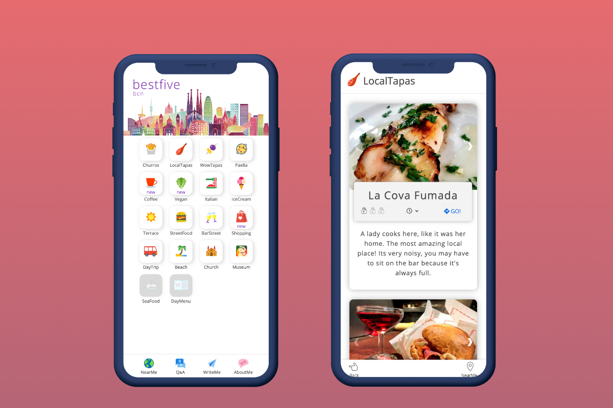

I made this app to solve a problem that my girlfriend and I had before the summer of 2019. We thought that it would be cool to have a simple app to find where to go in Barcelona during a sunny day, and then we started adding more categories.

<mark>At the moment I’m rebuilding this app, I had an idea to develop this simple concept, adding a new business model around it.</mark>

### How is made it?

- JavaScript
- Firebase
- Google Maps
- Google Analytics

### Why I built it?

I also built this app to test my skills, at that time I had practically zero experience on how to plan and structure a new project.

<strong>In short:</strong>

1.  I'm really intrigued by new challenges.
2.  I was totally motivated to solve a common problem for my girlfriend and I and use something made by myself.
3.  I was intrigued by the idea of building my first business.

> With my actual knowladge I can criticize the structure of the code base. I could improve the use of JavaScript and the data management, utilizing a service like MongoDb atlas or Firebase Firestore.

### What I've learned?

1.  How to use vanilla JavaScript.
2.  How to deal with external libraries and customize it for the project needs.
3.  How to solve problems about coding implementation and interaction between different services.
